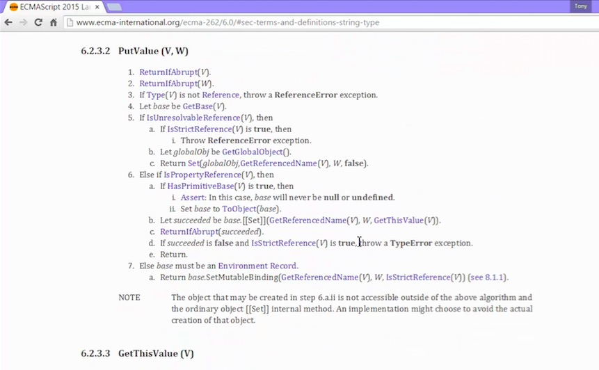

# Javascript Aside: Javascript engines and the ECMAScript Specification

## Big Word
*ECMAScript*: The standard javascript is based on

Needed a standard since there are many engines.

*Javascript Engine*: A program that converts javascript code into something the computer processor can understand

And it should follow the ECMAScript standard on how the language should work and what features it should have.

## Visit the ECMA official website

