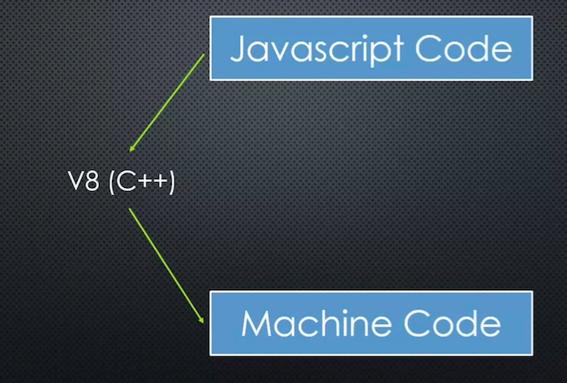
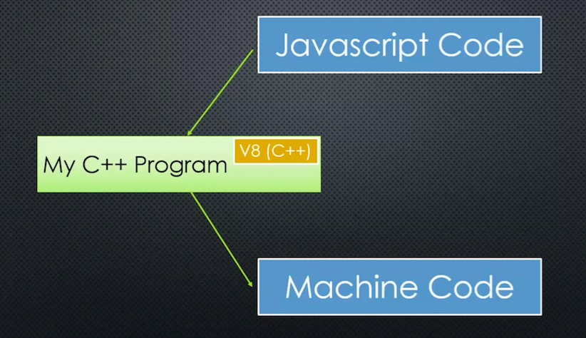
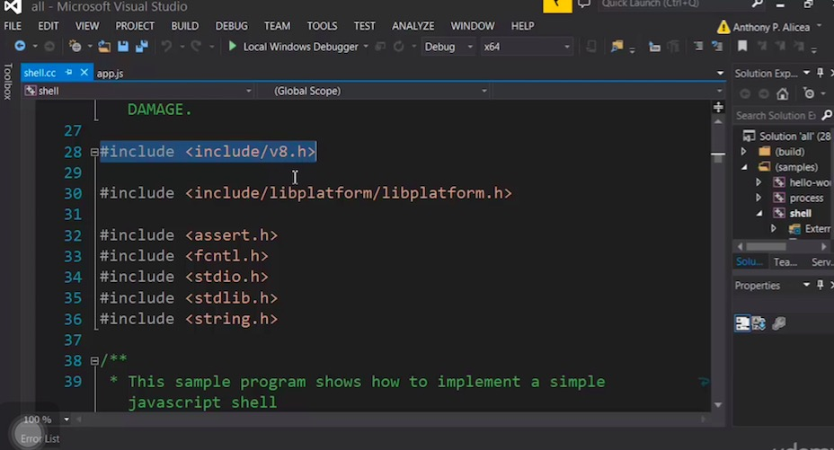
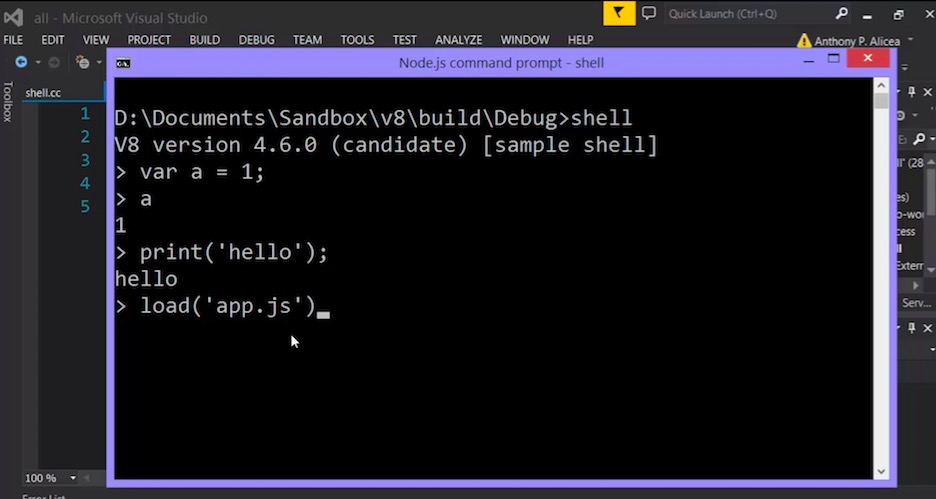
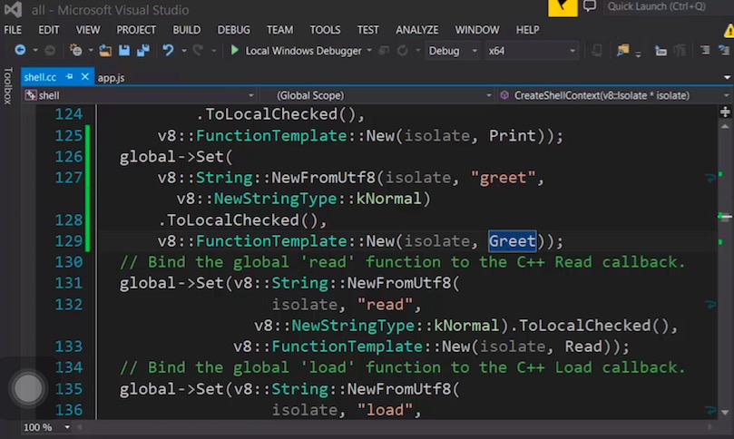

# Adding Features to Javascript

+ What we're going to talk about for the rest of the course, what features node has added to javascript!!!
+ Checkout the V8 embedder's guide
+ Hooks to outer C++ program(https://developers.google.com/v8/embed)






## V8 has Hooks

+ shell.cc is a program written in C++
+ it includes V8 engine
+ it runs a prompt, when it runs, it give text to V8 and convert it to machine code and return whatever V8 gives back
+ print is not specified in ECMA, but the shell.cc adds a hook to V8, when V8 see *print*, it will run a specific C++ code
+ that's also how *load* works and that's how you add features that are not in javascript to javascript
+ Tony adds a C++ written *greet code* and hook it to V8, so *greet()* is now native to *this javascript *implementation*



This is what the C++ written program shell.cc look like



Print and load is now native to JS because hooks added to V8 that trigger C++ code in Shell.cc



If you know C++, you can write your own C++ code and hook them to V8, you can keep adding functions and expanding it. whatever you can do with C++ you can do with javascript now, that's how Node make javascript power, because Node hooks V8 with features that are not available originally in javascript to make it suitable to be a server-side technology.


```
shell -- print_code    allow you to see the JS converted machine code
```
