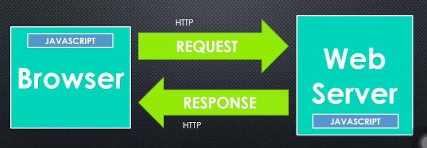

# Conceptual Aside: Servers and Clients

+ Server does most of the heavy work
+ In past, server-side language are PHP,C#,Ruby..
+ Now, Javascript can run on server-side thanks to Node
+ Browser is a program with JS engine embedded in it, AJAX and DOM are not in ECMA standard

