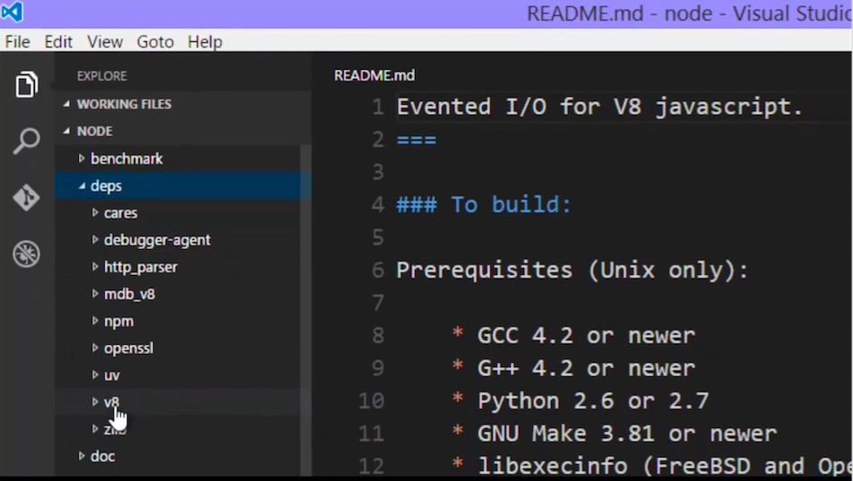

# The C++ Core

This is the area on Node that adds new features, about what makes node a server-side tech

+ Download the NodeJS Source Code on github, you don't have to do this, but it will help
+ It was first develop by Joyent, but later become more open source.
+ Libuv first develop by Joyent, and lot of other dependencies


## References
https://github.com/nodejs
https://github.com/joyent


## Dependencies
Things that built outside of Nodejs but are a part of NodeJS




+ V8
+ npm
+ http_parser
+ uv  -- livuv by Joyent
+ zlib  -- for zip files

They are all just C++ code embedded into nodejs
[How nodejs include V8](../imgs/nodejshIncludeV8.png)


```
C++ core is  core of features and utilities built in C++ and make available for javascript via the hooks in the V8 engine
```

## Mental Model
+ NodeJS is not javascript
+ NodeJS accepts javascript that allow us to have/write more features than normal
