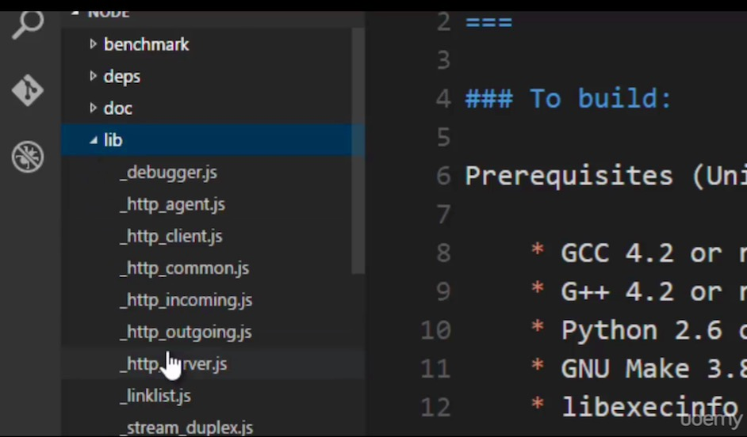

# The Javascript Core

**These pure js libs make using those C++ dependency features easier for you**

+ Under the lib folder in Node source code are a bunch of JS file
+ There JS files fetch the features in dependencies to make it available in javascript and easy for you to easy
+ So when you require extra features, you don't deal with C++ code, you use a javascript lib to get that function
+ Not all js files in this folder are for getting C++ functionalities, the util.js for utility js function you can write youself

