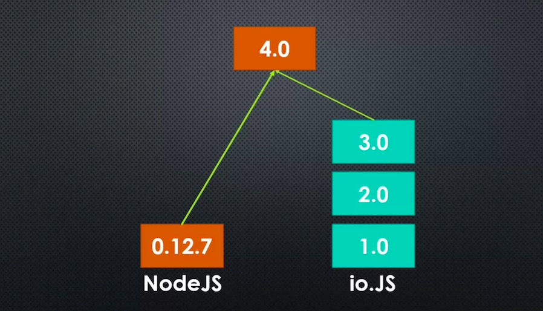
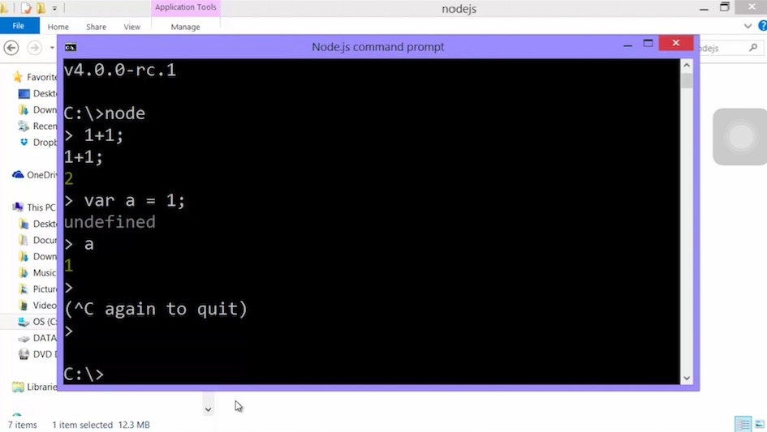
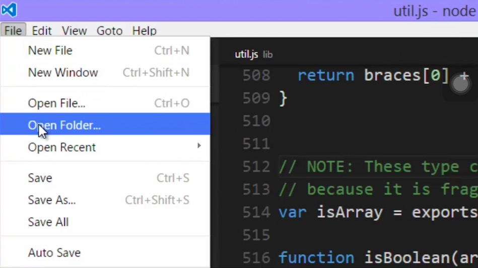
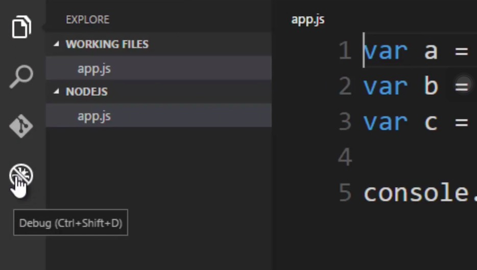

# Let's install and run some javascript in Node

+ Go to NodeJS official website, install it
+ Check version by entering ``node -v`` in your command line tool

## Version Side Note

NodeJS and IO.JS

## Directly input to NodeJS

+ Open up your terminal/command line prompt
+ Key in *node* and hit enter
+ Type in any JS code you want, Node will throw them to V8 and give you back the what V8 returns

## Run a JS file with Node

+ Key in node [the name of your JS file] , this will give Node an entry point to run your JS
+ Open up Visual Studio Code, open a folder, create your JS file
+ Go to Debug tool, hit run, this will add some setting files to your folder
+ Hit run again to run your file with Node, you can also set breakpoint

## Big Word
*Breakpoint*: A spot in our code where we tell a debugging tool to pause the execution of our code.

So we can figure out what's going on ...
