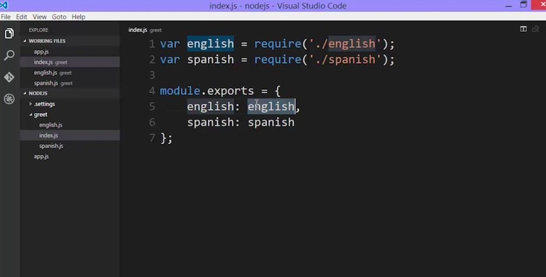
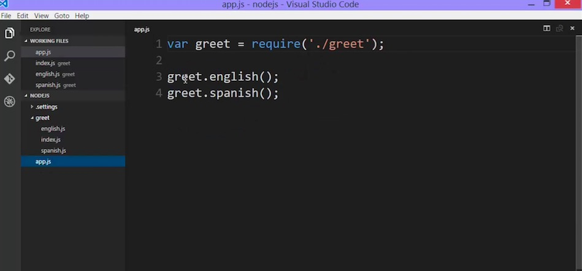
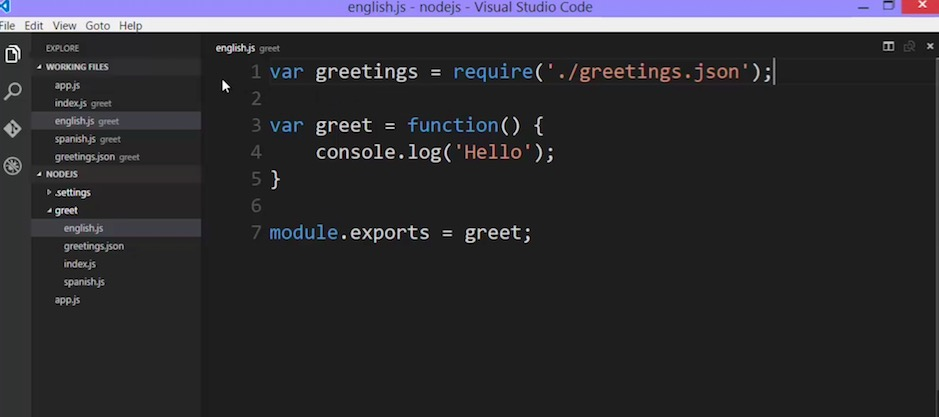

# More on require

+ Require will look for folder when file is not found
+ It will look for index.js in that folder
+ You can structure your module that way

## What About JSON?

+ Require will convert JSON to object
+ You don't have to worry about module.exports
+ Get your hands dirty and mess around with modules, as a NodeJS developer, you'll deal with modules a lot
+ It's very important, you might use JSON to store data or configuration
