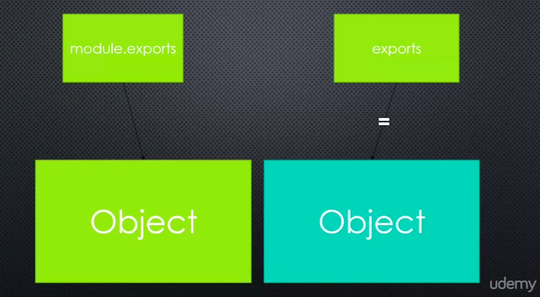

# exports VS module.exports

## Big Word
**Mutate: To change something**
For example, adding a method or property to an object means you've mutated the object.

**shorthand export does not work with all patterns we seen**





+ By reference, you can change it,mutate it, but when you use equal, you broken that reference
+ You can use export, but only to mutate the object, you can't replace it
+ This is a weird thing is Javascript when dealing with setting reference


## The code

### greet.js
```
// we use = to assign shorthand export, thus, we BREAK that reference
// now expoet points to a different location in memery

exports = function() {
	console.log('Hello');
}

console.log(exports);
console.log(module.exports);

```

### greet2.js
```
//we use mutate it this time, so it will work


exports.greet = function() {
	console.log('Hello');
}

console.log(exports);
console.log(module.exports);

```


## Just use module.export
