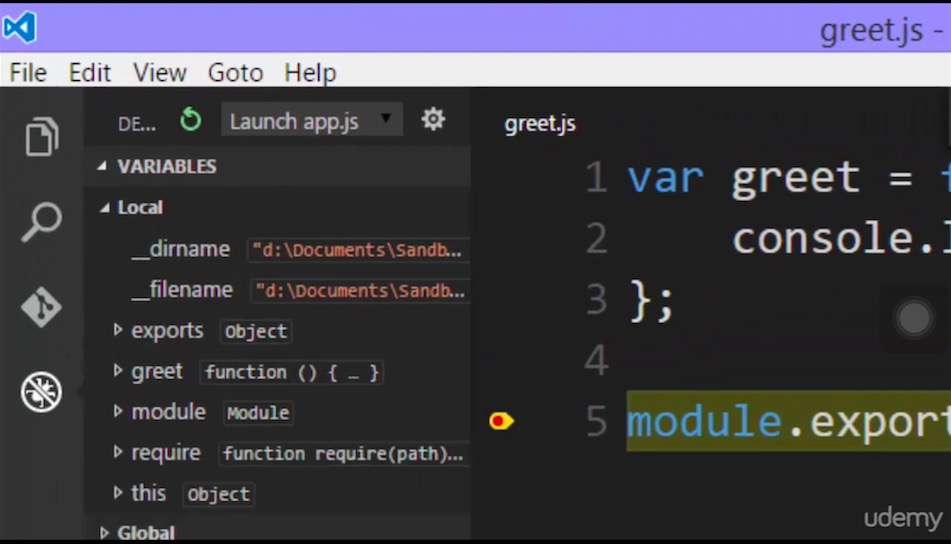

# Let's build a Module

+ You should give your application an entry point, it usually is APP.js
+ Then you load the module with require


## How require and module really work?


+ When run with debugger, on the left is the variables that are available to you
+ ``this`` is set up to your by ECMA standard
+ But what is ``module`` and ``exports`` object?
+ We will find this out in the next chapter


## APP.js

```
// ./means what we require is in the same folder as this file sitting
// we use require to get our first module


var greet = require('./greet.js');

// now you can call greet() now that are in other module
// you did it on porpose, not moduel accidentlly impact other code

```


## greet.js
+ This is our module
+ It does not accidentally impact other code

```
//our first module

var greet = function(){
    console.log("Hello");
}


// notice you can call greet() here,
//but you can't call it in app.js due to security reason
// because a module does not ACCIDENTALLY impact other code
// *Module: A reusable block of code whose existence does not accidentally impact other code*

greet();


// allow you to make ariable a varibla or function
module.exports = greet;


```
