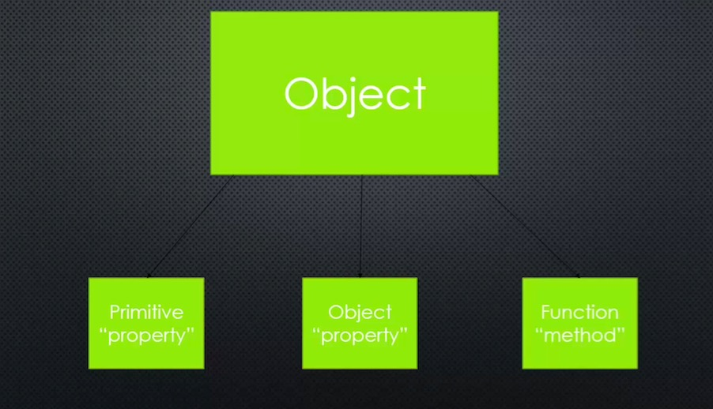

# Javascript Aside: Objects and Object Literals


## Big Word

**Name/Value pair: A name which maps to a value**
The name may be defined more than once, but only can have one value in any given context.
That value may be more name/value pairs.

**Object: A collection of name/value pairs**
The simplest definition when talking about javascript

**Object Literal: Name/value pairs separated by commas and surrounded by curly braces**
This is just a quick, shorthand way to create Javascript objects in code.


## The code

```
// using object literial to create object
// so much faster

var person = {
	firstname: 'John',
	lastname: 'Doe',
	greet: function() {
		console.log('Hello, ' + this.firstname + ' ' + this.lastname);
	}
};

person.greet();


// instead of the standard dot,
//you can also use brackets to access your object
console.log(person['firstname']);

```



