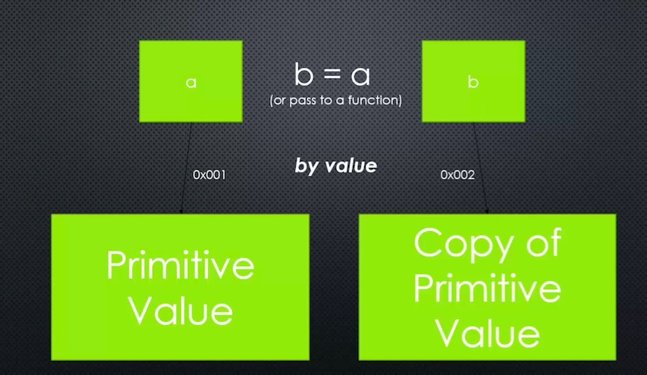
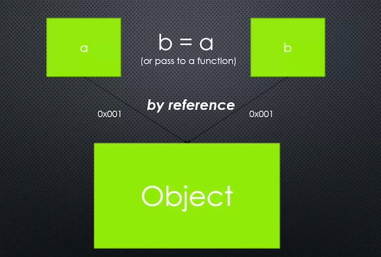

# Javascript Aside: By Reference and By Value

## Big Word

**Primitive: A type of data that represents a single value**
Like a number or a string. In other words, *not an object*.

## By reference and by value






## The code

```


```
