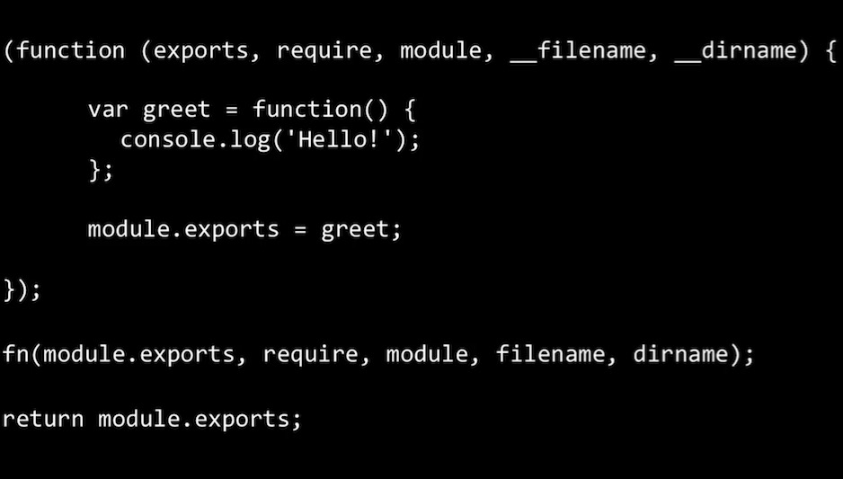
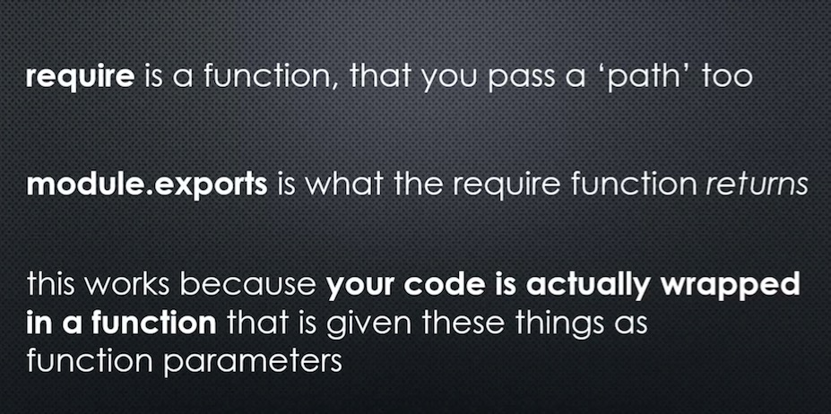

# How do node modules really work? : module.exports and require

Wrapper function

NodeJS does not directly give what we wrote to V8, it wraps it to a wrapper function and pass it to V8

+ Require is a function
+ What we wrote in the greet module isn't directly given to V8
+ NodeJS wraps our module into a wrapper function(Safe, protective)
+ What's return from that wrapper function is ``module.exports``

