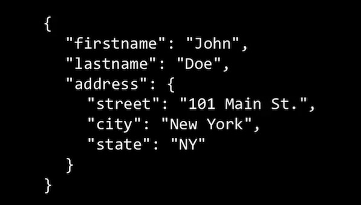

# Javascript Aside: JSON

## Big word

**JSON: 'Javascript Object Notation' -- A standard for structuring data that is inspired by Javascript Object Literals**

Javascript engines are built to understand it

