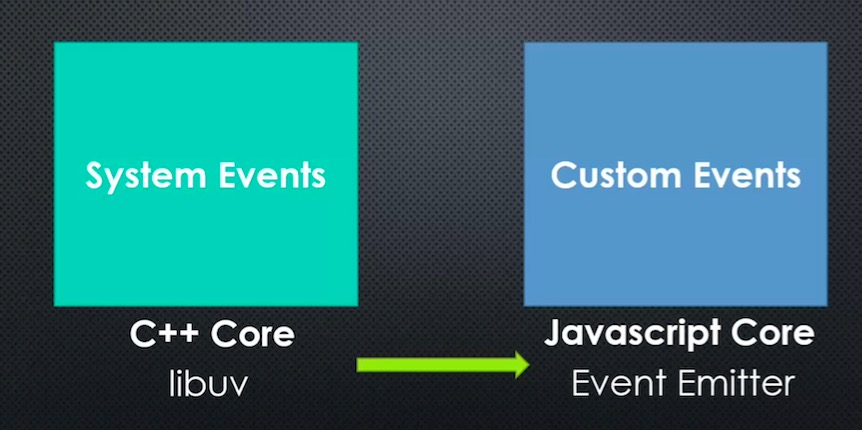

# Conceptual Aside: Events

## Big Word

**Event: Something that has happened in our APP that we can respond to.**

In Node we actually talk about two different kinds of events.

+ There are two different kind of events
+ Libux is very important
+ Re watch this, I don't quite get it yet
