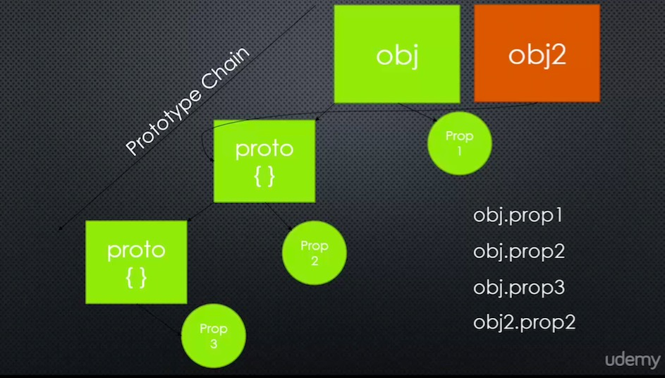

# Javascript Aside: Object.crate and Prototypes



## Code
```
var person = {
	firstname: '',
	lastname: '',
	greet: function() {
		return this.firstname + ' ' + this.lastname;
	}
}

var john = Object.create(person);
john.firstname = 'John';
john.lastname = 'Doe';

var jane = Object.create(person);
jane.firstname = 'Jane';
jane.lastname = 'Doe';

console.log(john.greet());
console.log(jane.greet());
console.log(john.__proto__) //this is not recommended
```

+ Unlike function constructor, object.create allow you to bind prototype to a specific object
+ An object's prototype is itself an object
