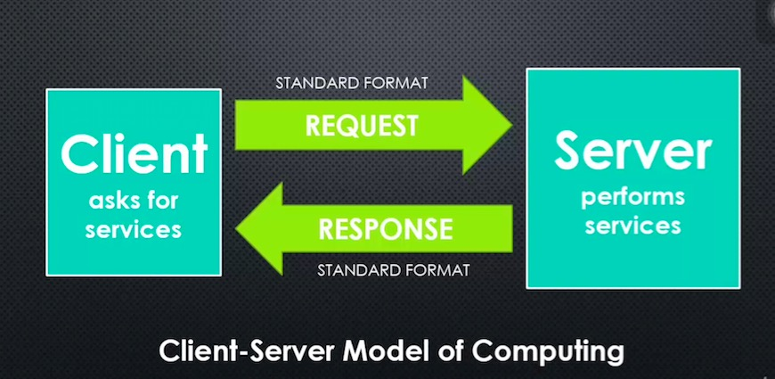
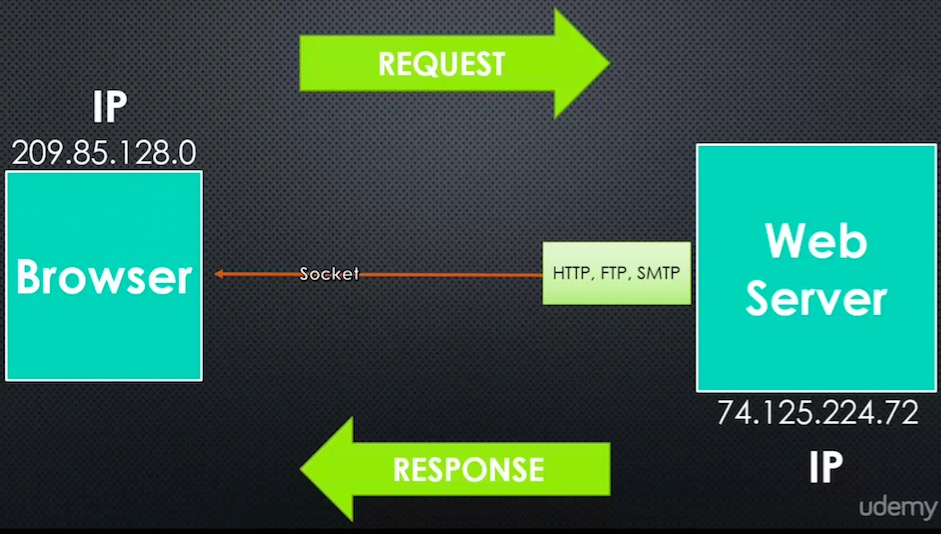
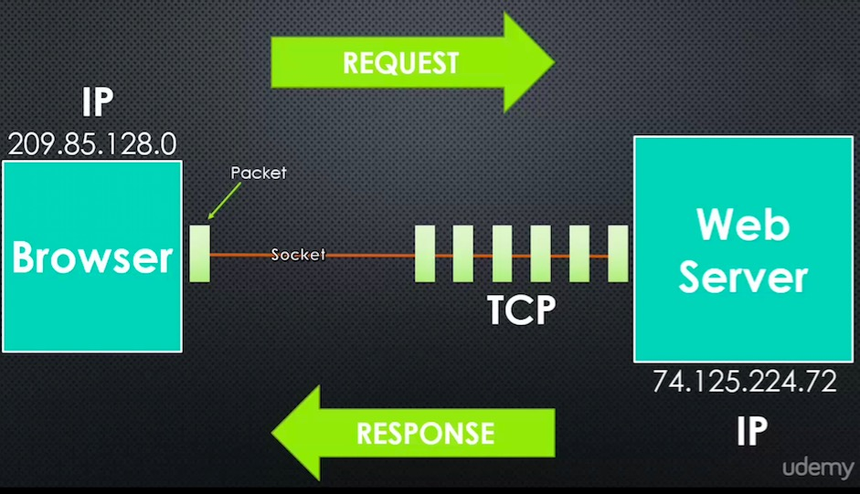

# Conceptual Aside: TCP/IP

## Big Word

**Protocol: A set of rules two sides agree on to use when communicating.**

Both the client and server are programmed to understand and use that particular set of rules. It's similar to two people from different countries agreeing on a language to speak in.

+ How to identify each other?
+ There is standard(Protocol), but how are the information actually transferred? (TCP/IP)

+ IP stands for internet protocol (We agree this number is how we connect to other computer)
+ When connect, your system will open a **Socket**
+ Informations are usually structured into its own type of protocol like HTTP, FTP, SMTP
+ P is protocol, it represents how the information is structured

TCP: transmittion control protocol (How infos are sent)
+ How matter how your infos are structured, TCP said, split that info into pieces and we will send that pieces one at a time through the socket
+ The individual piece is called a packet
+ We need IP to know where to send them, so we refer them to TCP/IP
+ TCP looks like a stream
+ Node treats there packet come along from the pipe line as chunks
+ Sockets are open and close often
+ Web sockets are to keep the socket open constantly

