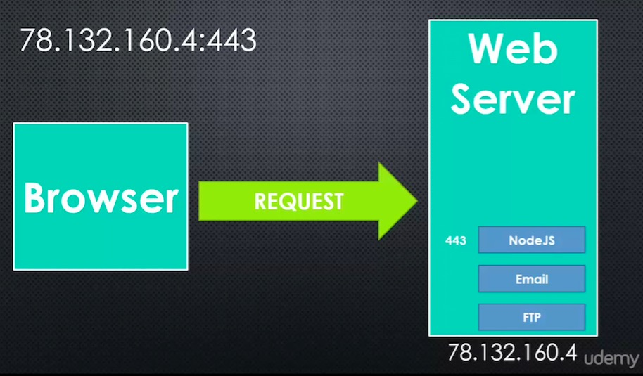

# Conceptual Aside: Addresses and Ports

**Port: Once a computer receives a packet, how it knows what program to send it to.**
When a program is setup on the operating system to receive packets from a particular port, it it said that the program is 'Listening' to that port.

