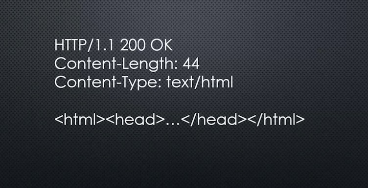
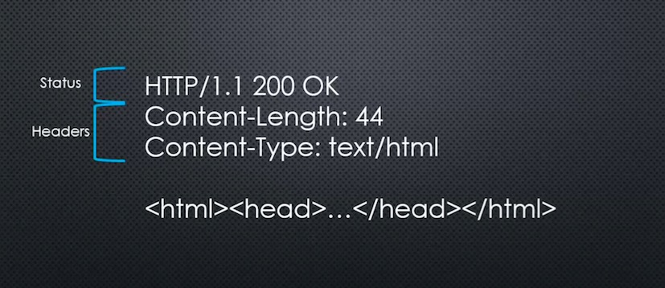

# Conceptual Aside: HTTP

## Big Word

**HTTP: A set of rules (and a format) for data being transferred on the web.**

Stands for 'HyperText Transfer Protocol'. It's a format (of various) defining data being transferred via TCP/IP.

**MIME TYPE: A standard for specifying the type of data being sent.**

Stands for 'Multipurpose Internet Mail extensions'.
Examples: application/json, text/html, image/jpeg

+ Contains HTTP Status
+ Contains HTTP Header
+ Contains HTTP Body
+ Also **MIME TYPE**

