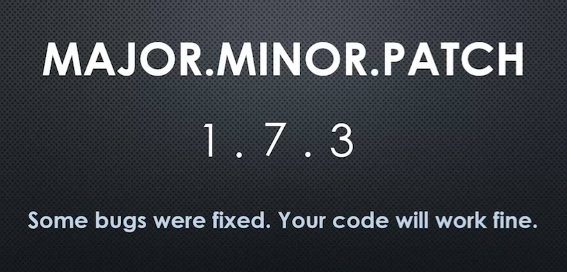
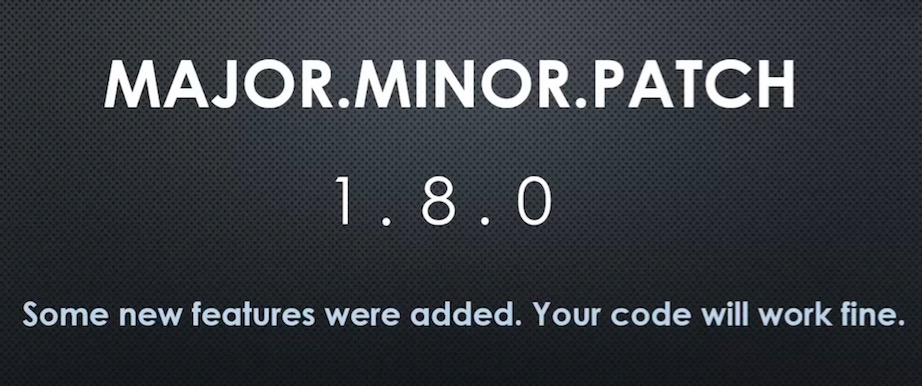
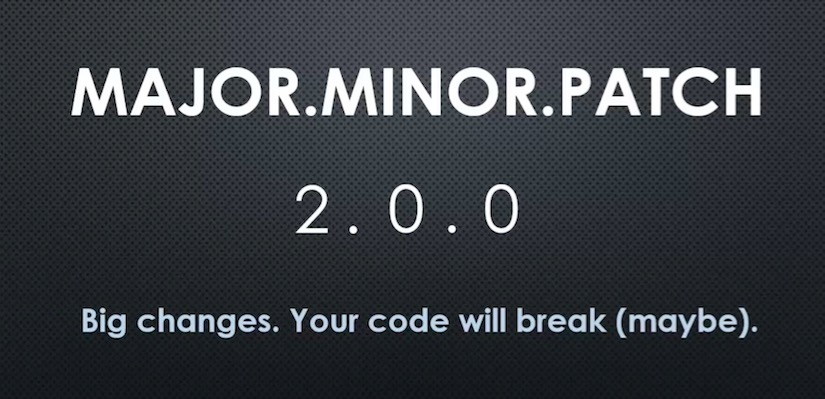

# Conceptual Aside: Semantic Versioning (semver)

## Big Word

**Versioning: specifying what version of a set of code this is...**

...So others can track if a new version has come out. This allows to watch for new features, or to watch for 'breaking changes'.

The word 'semantic' implies that something conveys meaning.

